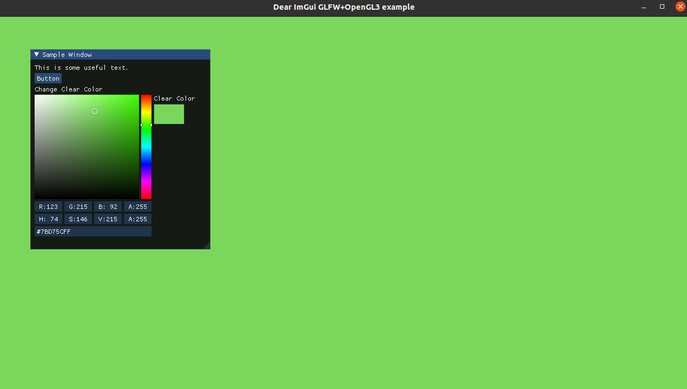

# GLFW DearImGui Template

Starter project for OpenGL with [DearImGui](https://github.com/ocornut/imgui) using cmake.

**Tested under Linux and vscode with C/C++ and Cmake extensions**

The template offer a starter example of a basic color picker to change the clear color of the window, as in Figure below.

-   `git clone https://github.com/Cryoscopic-E/GLFW-DearImGUI-Template.git <yourfolder>`

- Change your project name in the _CMakeLists.txt_ in the root folder.

- To build the project:

    `cd <yourfolder>`

    `mkdir build`

    `cmake ..`

    `make`
